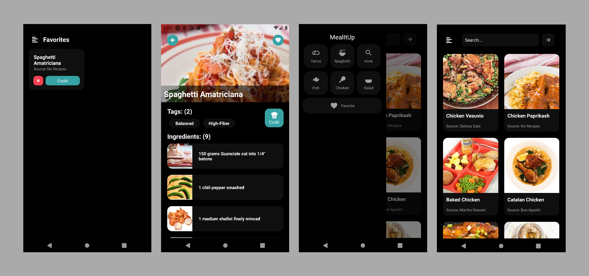

# MealItUp


<br>
Welcome to MealItUp, our food app built with React Native and Expo! This app allows you to search for and save your favorite recipes using the Edamam API.

I built this app as a challenge in just one weekend, and I'am proud of what I was able to accomplish in such a short amount of time. Despite the tight timeframe, I was able to create a high-quality app with a clean and intuitive user interface.

It is worth mentioning that one of the standout features of MealItUp is the use of shared elements. I used the "react-native-shared-element" library to create smooth transitions between screens, which helps to create a more seamless user experience. Additionally, we utilized the "@shopify/flash-list" library for better performance. 

Whether you're a seasoned chef or just starting out in the kitchen, MealItUp has something for everyone. You can search for recipes using specific ingredients or filter them by categories. You can also save your favorite recipes in the favorites section for easy access.

I hope that you enjoy using MealItUp as much as I enjoyed building it. Feel free to contribute to the project or use the code as a starting point for your own app. Happy cooking!

## Expo Demo
You can scan qr down  below using Expo mobile app to load this project immediately.


<br>

## Getting Started
To get started with the app, you'll need to have Node.js and Expo CLI installed on your computer. Once you have those installed, you can clone the repo and install the dependencies using npm:

```
git clone https://github.com/DontAskForAnything/MealItUp.git
cd MealItUp
npm install
```
After that configure .env file, by providing Edamam API data.

Then, you can start the app using Expo:
```bash
expo start
```
This will launch the Expo development server, and you can use the Expo app on your mobile device to view the app.

<br>
Ummm... something is not working.... umm let me know 😁